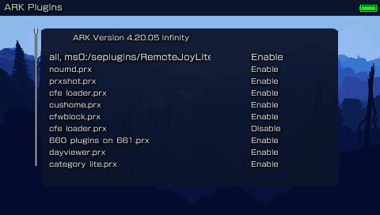
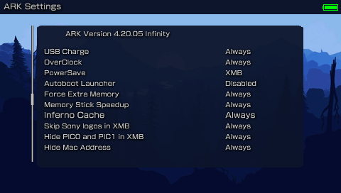
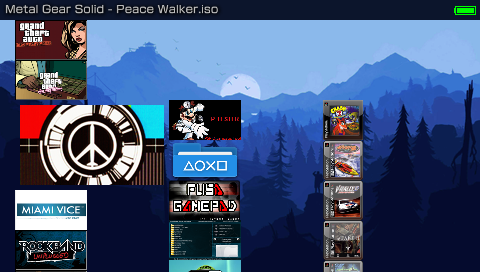
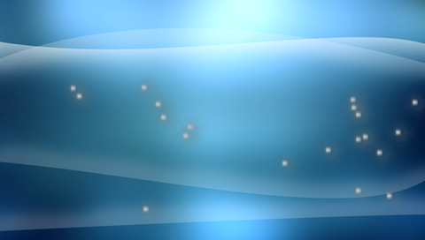
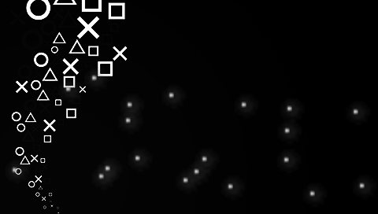

# ARK-4 e/CFW for the PSP and PS Vita.

New, updated, improved and modern `Custom Firmware` for the `PSP` and `PS Vita`'s `ePSP`.
Simple to use and full of unique features, `ARK CFW` aims at keeping the `PSP` experience fresh. Being a successor to `PRO` and `ME`,
`ARK` is now the most feature-complete `CFW` for the `PSP`, having all features from classic `CFW`
as well as unique and exclusive new features not found anywhere else.

## FEATURES:

- `Core` system heavily updated from traditional CFW with new exclusive features.

- `Inferno 2` Driver compatible with all formats (`ISO`, `CSO`, `ZSO`, `JSO`, `CSOv2` and `DAX`).

- `Popcorn` controller for custom `PS1` games. Compatible with `PopsLoader` V3 and V4i.

- Built-in `No-DRM` engine `Stargate`, fixes many anti-CFW games. Compatible with `npdrm_free` by qwikrazor87.

- `Plugin` support for `PSP` games, `PS1` games and `VSH` (XMB), including the ability to enable and disable plugins `per-game`.

- `Region Free` playback of `UMD Video` on all PSP models. Change the region of your `UMD` drive on-the-fly.

- Compatible with all `PSP` models on firmwares `6.60` and `6.61`.

- Compatible with all `PS Vita` models on firmware `2.10` up to `3.74`, either official firmware or via `Adrenaline`.

- Compatible with `6.60` `Testing Tool` Firmware and `Testkit` Units.

- Compatible with `6.60` `Development Tool` Firmware and `Devkit` Units.

- Can be fully installed and booted on memory stick in compatible models via `Time Machine`.

- Can be used to unbrick any PSP using `Despertar del Cementerio` in combination with a `Pandora` or `Baryon Sweeper`.

- `Minimalistic`: only 6 files installed on PSP flash, CFW extensions are installed on memory stick.

- Resistant to `soft-bricks`, easy to recover from bad configurations with a new and improved `Recovery` app.

- `Custom game launcher` with built-in game categories, file browser, `FTP` server and client, modernized look and more.

- Fully configurable via the `XMB`.

- Compatible with `PRO Online` and `Xlink Kai`.

- Compatible with Legacy Homebrew via `eLoader` and `Leda`. Compatible with the KXploit format.

- Compatible with `cIPL` and `Infinity 2` bootloaders for permanent CFW.

.png "ARK Custom Firmware")

.png "ARK Custom Firmware")

.png "ARK Custom Firmware")

## INSTALLATION

- Download the precompiled binaries from: https://github.com/PSP-Archive/ARK-4/releases/latest

  
 <b> Compiling ARK ( For Developers ) </b> 

    Build script will allow you to use the correct SDK that ARK was built with.

- Release: `./build.sh` 
- Debug: `./build.sh --debug`
- Manually: install the oldest possible SDK (ideally the one used to compile M33), then run `make`

Use `-h` or `--help` to show all available flags 

  
 <b> On PSP </b> 

  
 <b> Online PSP Installer </b> 

  For an easy deployment of ARK on a PSP connected to the internet, you can follow this video:
  https://www.youtube.com/watch?v=mopy1N57DlI

##### Manual installation  
  
The instructions are as follows:
  
- Install `ARK_01234` folder into `/PSP/SAVEDATA/` folder.
- Install `ARK_Live` folder into `/PSP/GAME/` folder.
- Launch `ARK Loader`. It will install ARK modules on PSP Flash and boot the CFW.

  
 <b> Live CFW </b> 

  - Delete `FLASH0.ARK` from `/PSP/SAVEDATA/ARK_01234` to prevent flashing files every time you reload the CFW.
  - Run `ARK Loader` every time you power off or hard reboot the device to re-enable `ARK`.

  
 <b> Permanent CFW via cIPL </b> 

  - Only works on 1K models and early 2K models (those compatible with Pandora).
  - Use `pspident` homebrew to identify your model and compatibility with custom IPL.
  - Copy `ARK cIPL` folder to `/PSP/GAME/` and run the program.
  - Press the corresponding button in the installation page to install or remove the cIPL patch.

  
 <b> Permanent CFW via Infinity </b> 

  - Works on all PSP models on 6.60 or 6.61 firmwares.
  - Copy or move the `EBOOT.PBP` (or `EBOOT_GO.PBP` renamed to `EBOOT.PBP` if using a PSP Go) from the `Infinity` folder found in the ARK download into `/PSP/GAME/UPDATE`.
  - Run the`Infinity` app using Official Firmware to run the initial installation.
  - Run `Infinity` a second time to configure autoboot by selecting ARK within the Infinity app. Run the ARK CFW again to activate. ARK will now be automatically activated on boot up.

  
 <b> Time Machine and Despertar del Cementerio </b> 

  - `Time Machine` allows to boot the `6.61` firmware and `ARK` entirely from the Memory Stick.
  - `Despertar del Cementerio` allows to revive a bricked PSP when used in combination with a `Pandora` or `Baryon Sweeper`.
  - To install `DC-ARK` you must first format the memory stick with at least 2048 bytes for the first (boot) sector (there are various guides on how to format a memory stick to prepare for DC).
  - You also need to be running a `CFW` to install `DC-ARK` (ARK itself or any other).
  - Copy the `ARK_DC` folder to the `/PSP/GAME/` folder and run the installer from the `XMB`.
  - Follow the instructions to install DC-ARK and create a magic memory stick.
  - On compatible models, use `Advanced VSH Menu` to create a `Pandora` battery.
  - Use a `Pandora` or `Baryon Sweeper` in combination with your newly created `Magic Memory Stick` to boot up `Despertar del Cementerio`.
  - From here you can either boot ARK from memory stick, install 6.61 Firmware with ARK on the Nand or install 6.61 Official Firmware.
  - Note that installing 6.61 firmware with ARK requires a cIPL-compatible PSP (1K and early 2K).

  
 <b> On PS Vita </b> 

  
 <b> Standalone </b> 

  - Works on Official Firmware 2.10 up to 3.74, doesn't require Henkaku/h-encore or any native hack.
  - Download a legit `PSP` game from `PSN`, the free demo of `Ape Quest` or `LocoRoco Midnight Carnival` is recommended. `Minis` are `NOT` recommended.
  - For Henkaku/h-encore users, install an ARK bubble using [ArkFast](https://disk.yandex.ru/d/XMJpxf7RD79VLw) (manually updated, create an issue if it's outdated).
  - Official Firmware users (no henkaku/h-encore) can install the PBOOT bubble manually: https://github.com/TheOfficialFloW/Trinity#preparation
  - Replace the ARK savedata folder (`ux0:pspemu/PSP/SAVEDATA/ARK_01234`) with the folder from latest release.
  - Copy `K.BIN` from `Vita/Standalone` folder into `ARK_01234` savedata folder.
  - To use right analog stick (i.e. gta_remastered plugin): https://github.com/rereprep/ArkRightAnalog
  - To `exit` from a game or homebrew back to the `custom launcher`, press `L+R+Down+Start`. Works on `PSP` too.
  - Some features are not available to Vita users, mainly the official Sony `XMB` and `PS1` games.
  - The kernel exploit is known to have stability issues, if it fails or crashes, simply restart your Vita and try again.
  - If you are running an old firmware (<3.60), you will need a spcialized `K.BIN`, either build one yourself or open an `Feature Request`.

  
 <b> Adrenaline </b> 

  - Works on Firmware 3.60 up to 3.74, requires Henkaku/h-encore and `Adrenaline` (https://github.com/TheOfficialFloW/Adrenaline).
  - Install `ARK_01234` folder into `/PSP/SAVEDATA/` folder.
  - Install `ARK_Live` folder into `/PSP/GAME/` folder.
  - Copy `K.BIN` from `Vita/Adrenaline` folder into `ARK_Live` game folder.
  - Open `Adrenaline`, (optionally) create a `savestate` to easily go back.
  - Launch `ARK Loader` from within `Adrenaline` and wait for it to load.
  - (Optionally) Create a `savestate` using `Adrenaline`'s built-in menu to easily load ARK.
  - (Optionally) Use `savestates` to easily and quickly switch between `Adrenaline` and `ARK`.
  - You can use `Adrenaline Bubbles Manager` to create an autoboot bubble for `ARK Loader`, allowing you to easily and directly boot into `Adrenaline-ARK`.
  - Note: this does not permanently modify `Adrenaline` in any way.

  
 <b> Update ARK </b> 

There are three ways to update `ARK`:

  - Use the `System Update` feature in the `XMB`. Requires your PSP/Vita to be connected to the internet.
  - Copy the `UPDATE` folder to `/PSP/GAME/` and run it.
  - Copy `ARK_01234` folder and (on PSP) run `ARK Loader` again to install new flash0 files.

  

  
 <b> Legacy Game Exploits (PSP & Vita) </b> 

- Considering the savedata exploit loads `H.BIN` from the savedata path.
- Copy every file from `ARK_01234` except `PARAM.SFO`, `SAVEDATA.BIN` and `K.BIN` (`ICON0.PNG` can also be ignored), into the hacked savedata folder.
- You need to have a `K.BIN` if you are running on an ancient Vita firmware (there's plenty of kernel exploit sources in ARK-2 and ARK-3 for reference).
- Run the game and trigger the exploit as normal, it should load ARK.
- If you have issues with stability, it might be necessary to run `freemem()` algorithm in the kernel exploit file (`K.BIN`).
  

## CUSTOMIZATION

  
 <b> Advanced VSH Menu Options</b> 

The default VSH menu packaged in `ARK_01234` is a simplified, easier to use version of classic VSH menus.
To have a more classic VSH menu with more advanced features you can select the `Advanced VSH Menu` from within the simplified VSH menu.

.png "Advanced VSH Menu")

Some of the features available in Advanced VSH Menu include:

- Change USB Device mount (Memory Stick, Flash, UMD).
- Protect Flash in USB Device mount.
- View available ISO drivers.
- Mount UMD Video ISO.
- Change Foreground/Background VSH Menu colors.
- Convert battery from normal to pandora and viceversa.
- Activate flash and WMA playback.
- Swap X/O buttons.
- Delete hibernation (PSP Go paused game).
- Convert classic plugins to the new ARK format.
- Boot Random ISO.

And more.

Installing on PSP Flash:

`WARNING`: for advanced users only, do not attempt this if you're not familiar with the PSP flash.

By default, ARK's VSH Menu is installed on the Memory Stick (in `/PSP/SAVEDATA/ARK_01234/VSHMENU.PRX`).
This has the limitation that you won't be able to access VSH menu without a memory stick.
If you want to permanently install VSH Menu you need to copy `VSHMENU.PRX` to somewhere on your computer and rename it to `ark_satelite.prx`,
which you can then copy to PSP's `flash0:/vsh/module/`, you can use the VSH Menu itself to enable flash0 via USB. The final path should be `flash0:/vsh/module/ark_satelite.prx`.

`NOTE`: even if you install VSH Menu on flash0, the one installed on Memory Stick takes precedence in loading.

  
 <b> Installing Plug-Ins </b> 

  
The easiest method to install a plugin is to simply copy its `.prx` (and other files/folders the plugin needs) to its default installation folder (typically `/SEPLUGINS/` folder) and navigate to it using the `File Browser` (built into Recovery Menu and Custom Launcher). Upon opening the `.prx` file, you will be given the options to select the runlevel, or type the game ID, where the plugin loads.

From there you can use the `XMB` or `Recovery Menu` to configure or remove your installed plugins.

.png "XMB Plugins Menu")

Alternately, you can manually install plugins by creating a file called PLUGINS.TXT in the /SEPLUGINS/ folder and/or ARK's savedata folder.

If coming from PRO/ME you can Import them from the `Advanced VSH Menu` section.

To install plugins use the comma-separated format (CSV).
Where the header is: runlevel, path, switch.
A few samples:
- game, ms0:/seplugins/cwcheat/cwcheat.prx, enabled
- pops, ms0:/seplugins/cdda_enabler.prx, 1
- vsh, ms0:/seplugins/cxmb.prx, true
- ULUS10041, ms0:/seplugins/lcscheatdevice.prx, on

You can enable plugins on more than one game:
- ULUS10041 ULES00502, ms0:/seplugins/cheatdevice_remastered.prx, on

You can use the following keywords to enable a plugin:
- 1
- on
- true
- enabled
- Anything else disables the plugin

You can use the following keywords to tell ARK when the plugin loads:
- `all`/`always`: if either of these keywords are used, the plugin will always load.
- `psp`/`umd`: plugin should only load on retail games (UMD/ISO/PSN).
- `homebrew`: plugin should only load on homebrews.
- `game`: plugin can load on both retail games and homebrews.
- `psx`/`ps1`/`pops`: plugin only loads in PSX games.
- `xmb`/`vsh`: plugin only loads in the XMB.
- `launcher`: use this if the plugin should only load in the custom launcher.
- `game ID`: if you specify a game ID (i.e. `SLUS000000`), then the plugin will only load on that game.

You can also disable a plugin on certain games where they might be problematic.
To do so, just add a disable line for the specific game ID after the enable line.
For example, enable cwcheat on all retail games except for GTA LCS (US) and GTA VCS (EU).
- psp, ms0:/seplugins/cwcheat/cwcheat.prx, on
- ULUS10041 ULES00502, ms0:/seplugins/cwcheat/cwcheat.prx, off

Some noteworthy plugins that are compatible with ARK include (but not limited to):
- CXMB.
- Leda.
- PopsLoader V3 and V4i.
- Custom Firmware Extender.
- PSPLink.
- GTA LCS and VCS cheadevice (including the remastered version).
- CWCheat.
- pspstates kai.
- XMB Item Hider v1.3-r3
- DayViewer.
- Categories Lite.
- CDDA Enabler.
- PRO Online.
- PSP 3D.
- ZeroVSH Patcher.

  
 <b> Configuration and Settings </b> 

You can use the XMB and/or the Recovery Menu to easily handle CFW settings. However if you prefer you can also manually handle the settings yourself.

.png "XMB Custom Firmware Settings")

You can create a SETTINGS.TXT file using the same format as PLUGINS.TXT to enable/disable some CFW functionality on different parts of the system.
Configuration settings you can use in ARK include:

- `overclock`: use this for better performance at the expense of battery time. Sets CPU/BUS speed to 333/166.
- `powersave`: use this for better battery life at the expense of performance. Sets CPU/BUS speed to 133/66.
- `usbcharge`: enables USB charging wherever you want.
- `launcher`: replaces the XMB with a custom menu launcher.
- `disablepause`: disables the pause game feature on PSP Go.
- `highmem`: enables high memory on models above 1K.
 You should only use this on homebrew runlevel as retail games were not meant to use the extra memory,
 and this can cause issues with cheat devices or other plugins that expect games to have their data at specific memory addresses.
 - `infernocache`: enables cache for Inferno driver, improving performance of some games.
 - `oldplugin`: enables old plugins support on PSP Go (redirects `ms0` to `ef0`).
 - `skiplogos`: skips the coldboot and gameboot logos.

You can use the same runlevels as used in plugins to tell ARK when the settings take effect (all/always, umd, homebrew, game, pops, vsh).

For example, you can overclock to highest CPU speed like this:
- always, overclock, on

Another example, overclock only on games, use powersaving on VSH:
- game, overclock, on
- vsh, powersave, on

This also allows you to enable settings on specific games:
  - ULUS01234, overclock, on
  - ULES01234, powersave, on
  

  
 <b> Custom Launcher </b> 

ARK comes prepacked with a very powerful launcher with a built-in file browser and highly customizable.

Some of its features include:
  
  - Playback of ISO and all CSO formats with PMF video preview.
  
  - Playback of UMD game discs.
  
  - Categorized and organized game menu by PSP Games, PSP Homebrew and PS1 Games.
  
  - Ability to scan savedata folders for games.
  
  - Compatibility with old VHBL, ARK-2 and TN-CEF file names and folder paths.
  
  - Ability to copy, move or delete entire folders.
  
  - File browser has built-in FTP client, allowing you to browse and copy files from another PSP.
  
  - FTP server and client can run simultaneously.
  
  - Ability to mount UMD Video ISOs using the file browser.

  - Ability to extract .zip files (up to highest compression) and .rar files (standard compression).
  
  - Ability to edit text files (.txt, .cfg or .ini).
  
  - Ability to install Plugins via the file browser.
  
  - Different background animation effects.
  
  - And more.

  
You can however change it to whatever you please. You can change the theme used by both the custom launcher and recovery menu by replacing THEME.ARK with your own.

 <b> Custom Launcher Themes </b> 

You can install themes within Custom Launcher (ARKMENU). Just place the `themes` folder anywhere on your PSP and use the file browser in the Custom Launcher to select which theme (`THEME.ARK`) you would like to install. By selecting it a submenu will pop up asking to install it or to preview the theme without installing.

You can add themes by copying the `THEME.ARK` and `resources` folder from your selected theme to `??0:/PSP/SAVEDATA/ARK_01234/`

<i>Orbs are animations and not part of the actual Themes </i>

Theme: ARK_Revamped

Theme: RED 

Theme: Peace Walker 

Theme: Matrix

Theme: Material Dark

Theme: GX Classic

Theme: Classic

Theme: Blue 2

Theme: Blue

Theme: Black

Theme: BadgerOS_Sprunk

Theme: BadgerOS

 <b> Other Launchers </b> 

Aside from the default launcher provided, there have been many  other custom launchers created by scene members, some better looking, some with more features, some more simpler, but all of them with personality, dedication and love from the community. Here is a list of all popular menus for ARK:

- ONEMenu by gdljjrod: https://github.com/ONElua/ONEmenu/releases

- vMenu by neur0n: http://www.mediafire.com/file/7acb5mhawx4gr9t/vMenu_ARK.7z/file

- yMenu by wth/yosh: https://docs.google.com/uc?export=download&id=0B0kWUCdtGmJwLUhRUlNJSWhMWVE

- gMenu by gbot: http://www.mediafire.com/file/oou5490qc99vr7d/gmenuARK.rar/file

- 138Menu by gbot: https://wololo.net/talk/viewtopic.php?f=53&t=33511

- pyMenu by Acid_Snake: https://wololo.net/talk/viewtopic.php?t=21942

Note: some of these menus have not been updated or supported by their developers in a while, they may not work well with modern ARK or real PSP hardware.

## Other

  
 <b> Credits </b> 

- `Team PRO` (the original developers of ARK): `Coldbird`, `hrimfaxi` and `Neur0n`.

- `qwikrazor87` for being such a genius and all his hard work with kernel exploits and ARK-2.
  
- `TheFl0w` for his advancements and research in CFW development and overall contributions to the scene.

- `meetpatty` for his excellent work in fixing bugs and adding important features like cIPL and DevKit support as well as porting `Time Machine` and `Despertar del Cementerio`.

- `Codestation` for his incredible work improving CSO speeds and creating the ZSO format.

- `TheSubPlayer` for all the wonderful themes made for the custom launcher.

- `UnkownBrackets` (maxcso) for his help understanding the DAX format and Inferno speed hacks as well as creating the CSOv2 format.

- `Zer01ne`, `noname120`, `astart` and other devs that have blessed me with their knowledge and wisdom.

- `Zecoxao` for his great work creating dumpers that would allow us to archive rare firmwares.

- `balika` for his research in porting M33 to modern firmware that has helped improve compatiblity in ARK.

- `hrydgard` for the PMF player as well as being an inspiration for the custom launcher.

- Every other giant shoulder I am standing on.

  
 <b> Warnings </b> 

- ARK comes with no warranty whatsoever. It was designed to be noob-proof, however it is possible for the universe to create an even greater noob capable of using ARK to destroy the Earth (or his PSP). I cannot be held responsible for this.

- ARK may cause ejectile malfunction if your hard drive is not hard enough.

- If this software malfunctions, you can turn it off and on again.

